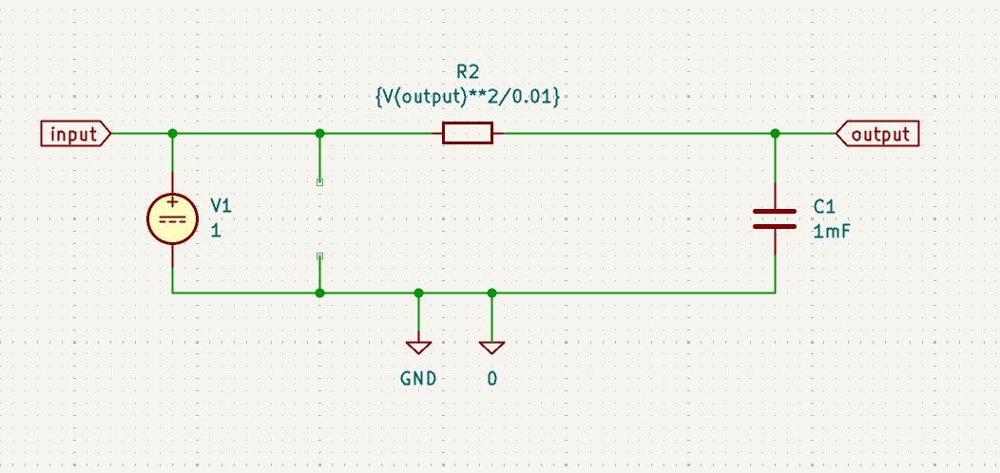
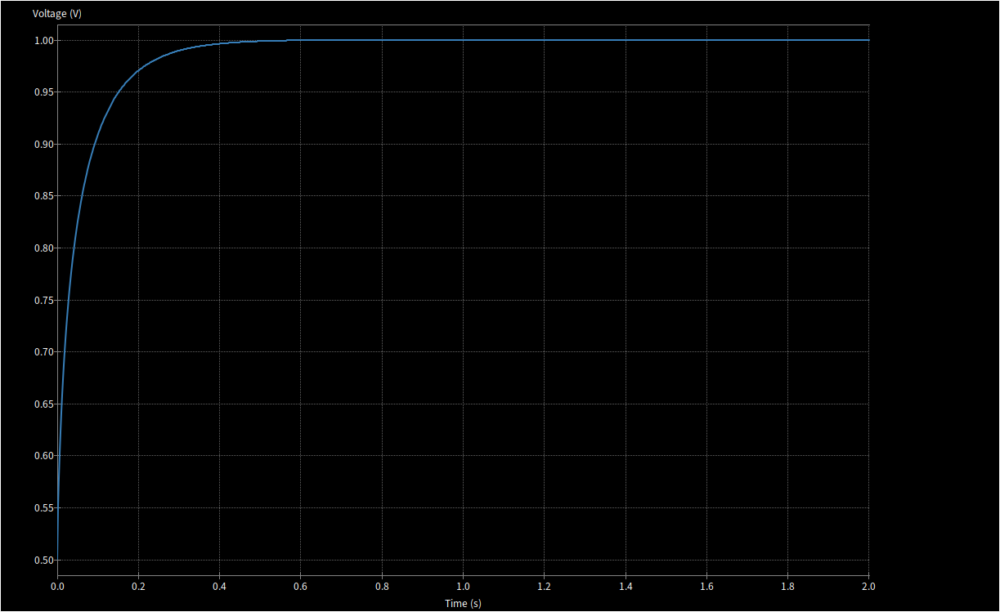
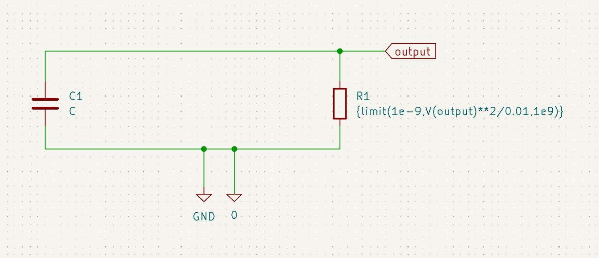
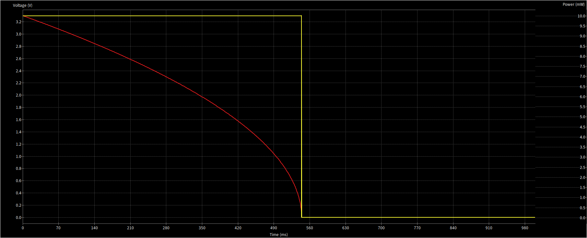

# shiny-train

`switcher` is the kicad project for the circuit
`sim` handles the SPICE simulation from the generated schematic

## Simulation

### Source

The source is modeled as a constant voltage source with a variable resistor to keep the power at a constant level.

### Sink

The sink is modeled as a variable resistor to draw constant power. The voltage and current will vary over time.

